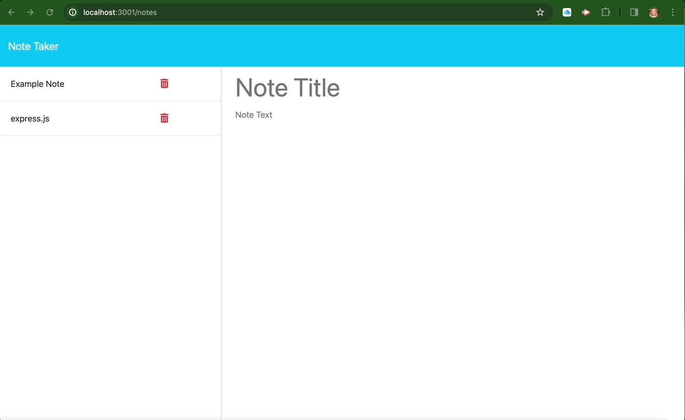
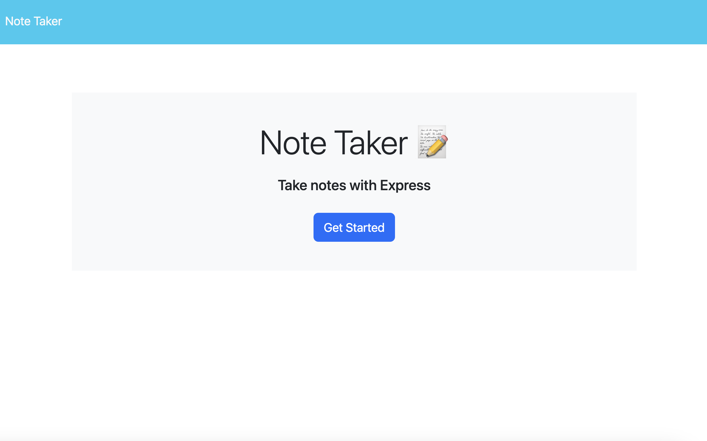
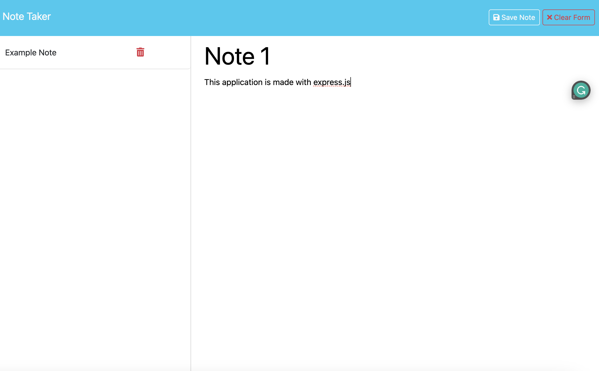
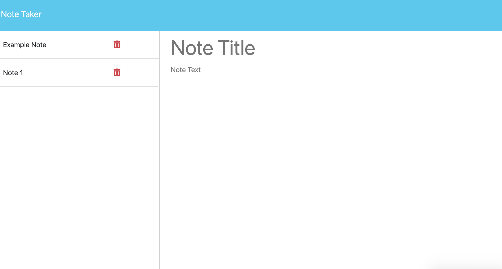
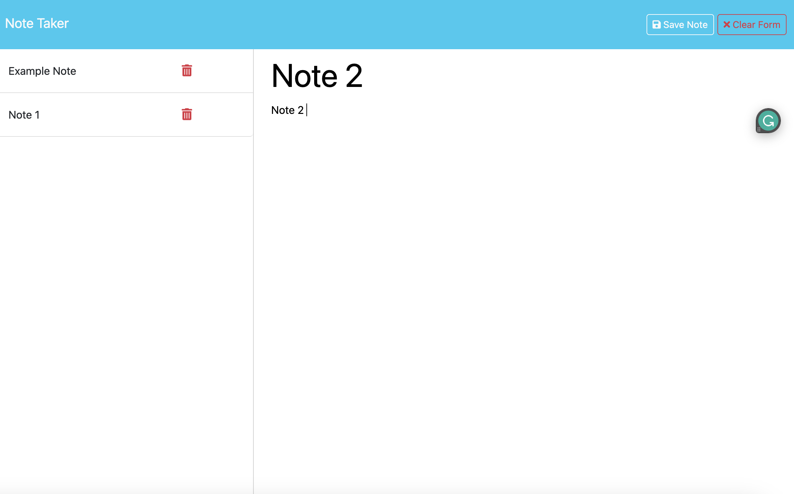
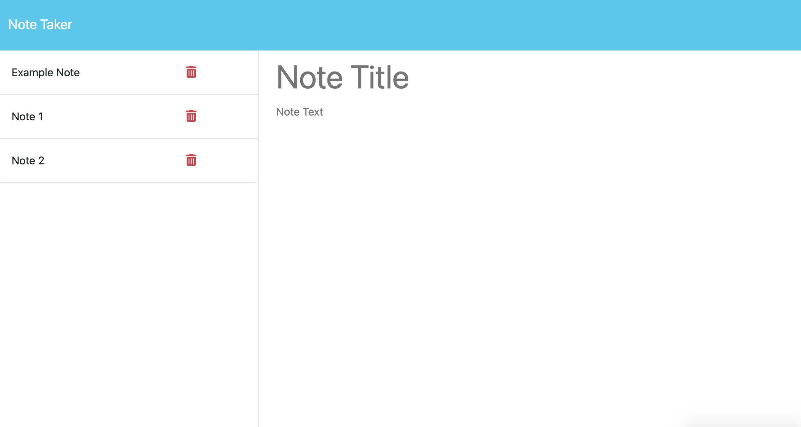
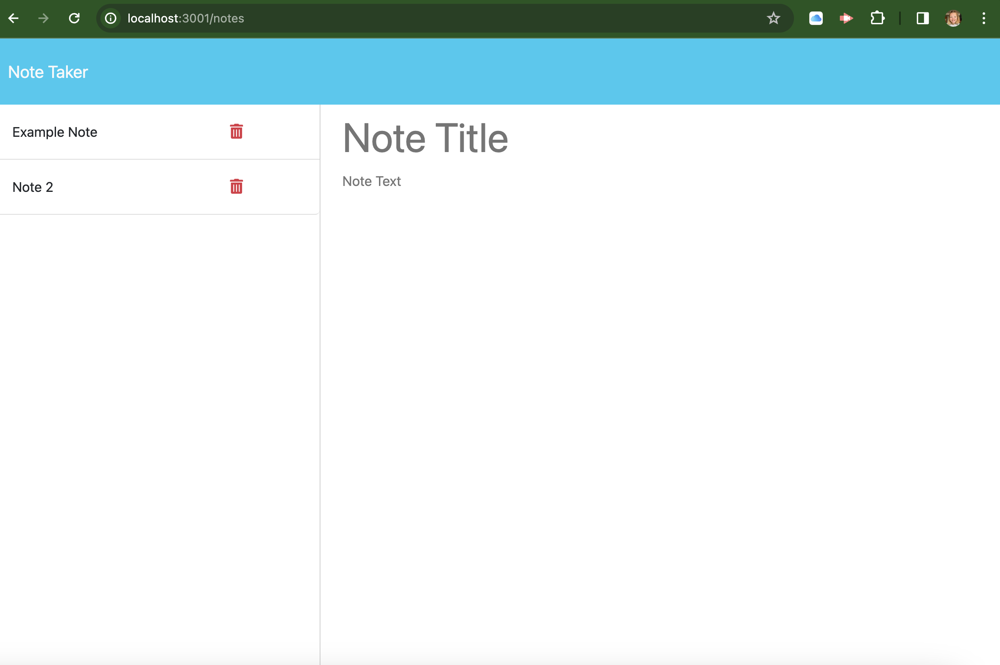

# Hiduchick-Note-Taker
Hiduchick UNH Bootcamp Challenge 11

## Dscription 
The inspiration behind the development of this application stemmed from the desire to create a dynamic and user-friendly webpage utilizing the power of Express. The primary goal is to provide users with a convenient platform to effortlessly jot down and organize their thoughts, tasks, and important information in one centralized location.One of the key features of this application is its ability to facilitate the seamless organization of notes. Users can save their notes within the application, ensuring easy access for future reference. This storage capability provides a valuable resource for users to revisit their thoughts, plans, or important details at any time.Moreover, the application acknowledges the dynamic nature of note-taking and provides an option to delete notes once they have served their purpose. This user-friendly interface encourages a clutter-free environment, allowing users to manage their notes efficiently and maintain a tidy digital workspace.

## Usage
1. Clone the repo 
2. Open the repo in VS code 
3. Open the terminal and run the command npm i to install inquire 
4. After inquire is installed run the command npm start to access the localhost port and open the application.

## Installation

1. Clone the repo
   git clone https://github.com/dhiduchick/Hiduchick-Note-Taker.git

2. Open in VS Code. If you do not have VS code you must install it.

## Link
(this application was unable to be deployed on heroku due to the student key not being provided to us)

## Demo

## Images 

# Author
Created with ♡ by Daelyn Hiduchick
